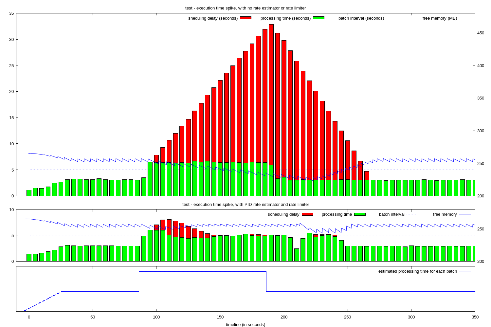
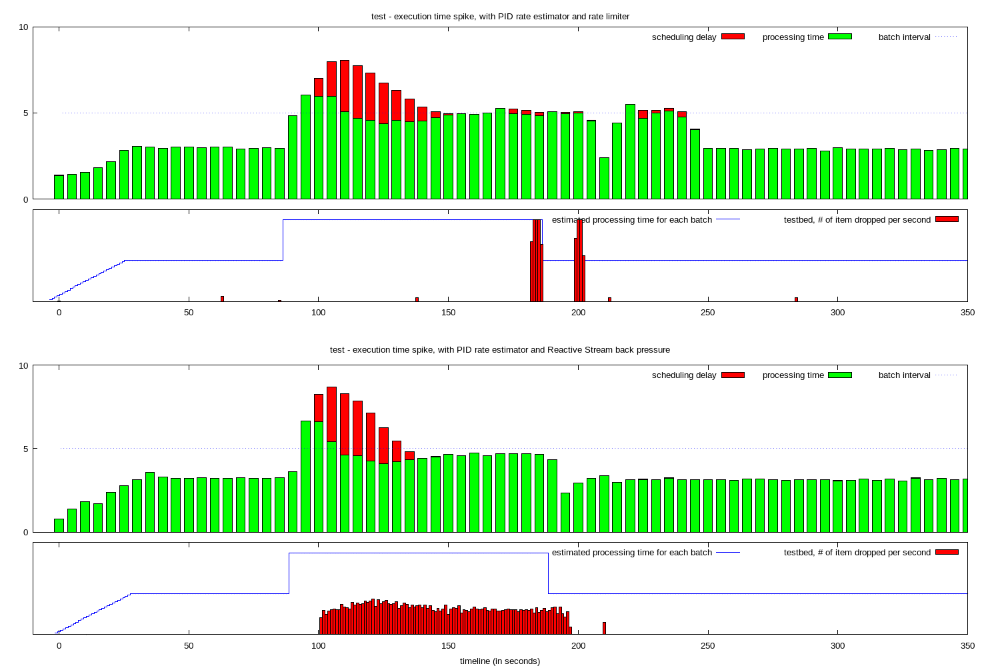

# Dynamic rate limitation in Spark 1.5.0

During the development cycle of Spark 1.5.0, we have been working on improving the resilience of Spark Streaming. The first step was to add support to know how a streaming job was performing. 

To achieve this, a rate estimator was introduced. It processes the data about each streaming batch (size of the input, scheduling delay and processing time) to estimate the size of the input that can be processed by the job during the batch interval. This information is pushed to the receiver which can use it to limit the size of the input, using a rate limiter or other approaches.

## PID controller

The rate estimator is using a PID controller, which allow to not only estimate the maximum size of the input, but also tune this value if some scheduling delay has been introduced. 

This is shown in the following graph. It is the result of a test in which the processing time spikes for a period, each batch processing time exceed the batch interval.

In the first run, without the rate estimator, scheduling delay keeps increasing along as batches take too long to be processed. The system recovers because the spike did not last long, but if it had continued, the scheduling delay would have grown to unreasonable level, and the system would have eventually run out of free memory.

In the second run, with the rate estimator enabled, the spike is detected. The size of the input is modulated, so the processing time stays below the batch interval, and to bring down the scheduling delay, which was created at the beginning of the spike.




## Configuration

The rate estimator is enabled by setting a property on the spark configuration of the streaming job. 

```
  sparkConf.set("spark.streaming.backpressure.enabled", "true")
```

# Dynamic rate limitation and Reactive Stream

We are working on one additional change, to make the feedback value available when implementing streaming receivers, using the `ReceiverInputDStream` infrastructure. The goal is to be able to create streaming receivers which can use the feedback data.

One of this receiver will be the Reactive Stream receiver. The advantage of such a receiver is to push the feedback data even further up the stream.

The next graph is a comparison of the existing TCP receiver, and the current prototype of the Reactive Stream receiver. The difference is in how the data over the feedback limit is handled.

The TCP receiver relies on TCP pushback to manage the input data. The data is not read right away if it is coming too fast. It means that the data stays in the TCP channel up to the point that the producer of the data cannot write in the TCP channel any more. This is visible as the 2 red spikes in the second part of the graph. In this simple test case, the excess data is logged and dropped.

With the Reactive Stream receiver, the producer is alerted quickly that the streaming job cannot handle all the data during the spike, and stop sending the excess data. The test has a straight forward producer which drops the extra data, but in a real system, it would have a smarter response (sampling, filtering, ...), or would send the back pressure information up stream.



One additional characteristic of the TCP receiver, which can be a problem, is the fact that even if the processing time is managed and the scheduling delay is reduced quickly, the input data might still not be processed in a timely fashion. During the spike, the extra data is kept in the TCP channel, and is read and processed later.

In the test, after a 100 seconds spike, it takes about 60 seconds for all the data accumulated in the TCP channel to be processed.
