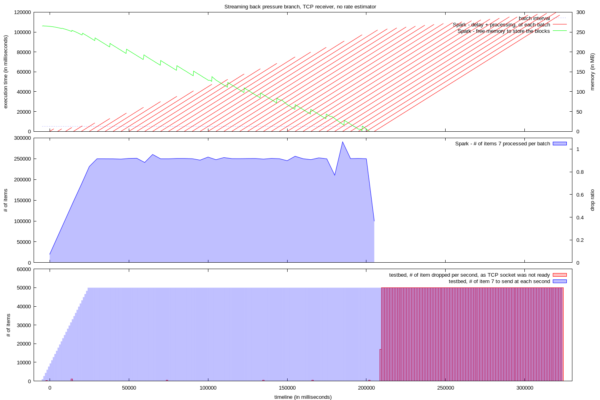
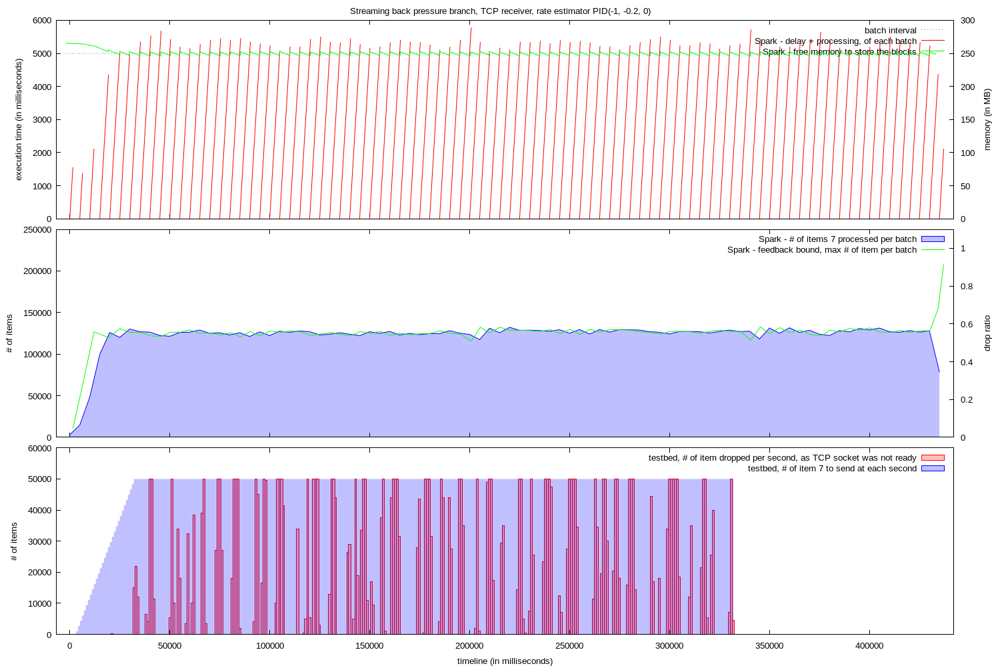
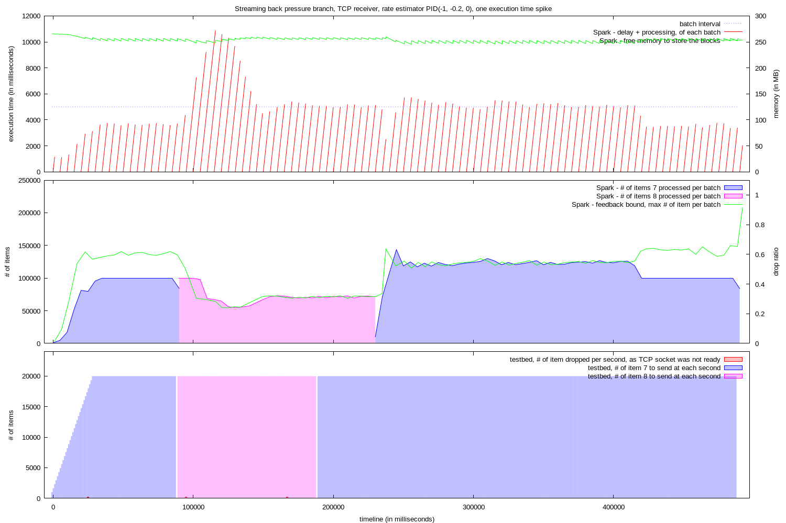
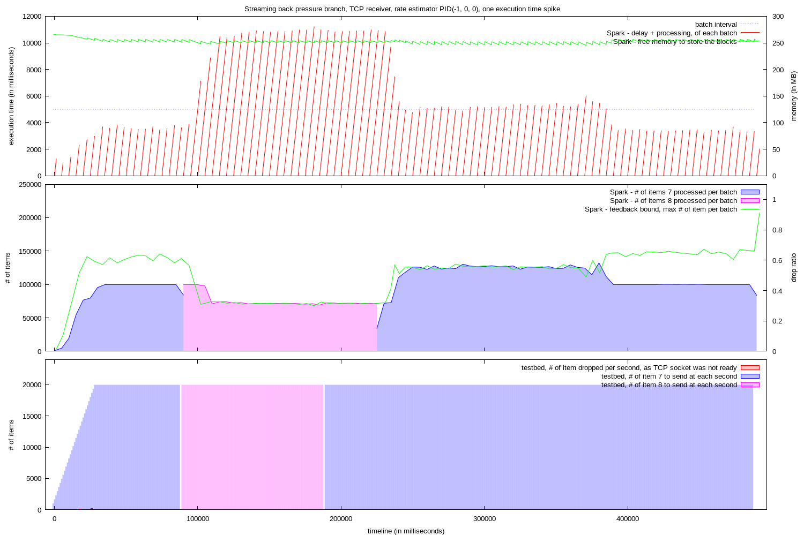

# Dynamic rate limitation

We have work coming in Spark 1.5. Which takes for a situation like this, where your streaming job crashes when your are not able to process the data fast enough, and filling up the executor memory:

To a situation where your streaming job is stable, by dynamically estimating the volume which can be handle for each batch:

# PID controller

To do the estimation, we are using a [PID controller](https://en.wikipedia.org/wiki/PID_controller). The 'Integral' part of the PID is important. It allows to react to the change of execution time of batches.

In this test, the execution time of the batches is doubled, without changing the volume of data. The system detects the change, updates the estimated rate, to keep the system stable, and to ensure that each batch is executed without scheduling delay.

Without the 'Integral' part, the system also reacts to the change in execution time, but it doesn't take scheduling delay into account.

So we have a system which is able to cope with additional data, or increased execution time, without having the risk of crashing.

# Reactive Receiver

### Rate limiter limitation

But the current rate limiter is only limiting the input data coming from the TCP connection, what is pushing back the problem in the worst way.

In a lot of cases, this push back is not visible to the producer of the data. The data is pushed into the TCP channel by the producer, where it stays until the streaming job reads it. In the 3rd test, it takes an additional 30 seconds for the streaming job to process all the spike data, after the testbed is done pushing this data.

And when the push back arrives at the producer level, it means that the TCP channel is full. In the 2nd test, the testbed sees that the TCP socket cannot accept more data, and acts on it (in this case, dropping the excess data). But it is not enough, we that after the publisher finished pushing data, it takes 100 more seconds to empty the TCP channel.

### Reactive Stream

Our next step is to create a Reactive Stream receiver. This receiver will take the limit provided by the rate estimator, and push it back to the publisher, which will be able to take an informed decision on what to do in case the streaming job is not able to process all the data.

# Full data

Additional information about these tests can be found [here](https://github.com/skyluc/spark-streaming-testbed/tree/test-runs-004/test-runs-004) --- TEMP URL
